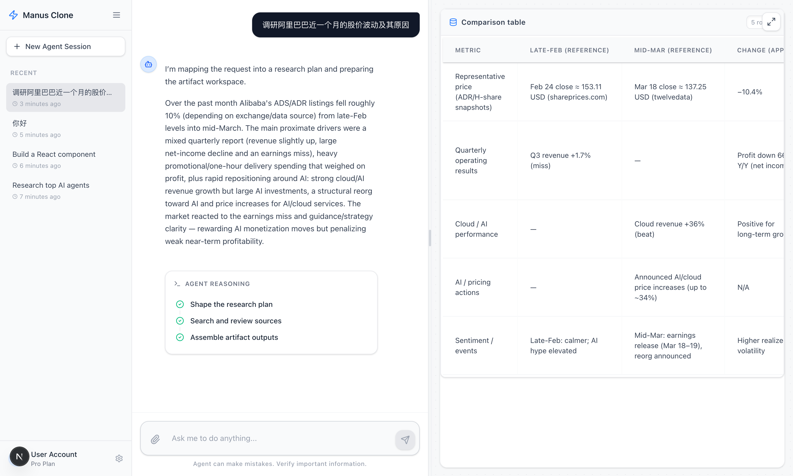

# My Manus

一个基于 `artifact` 的 AI Agent 平台原型。



当前版本采用：

- `Next.js 16` 作为前端壳层
- `Express` 作为 API 服务
- `LangChain / deepagents` 作为 Agent 研究链路
- `AG-UI` 作为 SSE 事件协议
- `A2UI v0.8` 作为 Agent-owned UI 协议

这版项目的目标不是做“黑盒自动代理”，而是做一套可观察、可追问、可沉淀 artifact 的研究型 Agent 平台。

## 当前平台能做什么

- 支持会话列表、聊天区、右侧工作区的基础产品形态
- 支持 `mock` 和 `live` 两种 Agent 模式
- 支持步骤时间线、assistant 正文、artifact 展示
- 支持动态步骤树，以及点击步骤回看对应 artifact
- 支持 clarification 和 approval 这两类基础 HITL 交互
- 支持通过 `AG-UI + A2UI` 协议流式驱动前端界面

## 仓库结构

- `apps/web`
  - Next.js 前端
- `apps/api`
  - Express API
- `apps/agent`
  - Agent 运行时
- `packages/shared`
  - 协议、共享类型、surface builders
- `packages/db`
  - Drizzle PostgreSQL schema
- `docs`
  - 技术方案、架构说明、迭代历史

## 快速启动

### 1. 安装依赖

```bash
pnpm install
```

### 2. 配置环境变量

复制一份环境变量模板：

```bash
cp .env.example .env
```

默认情况下：

- `AGENT_EXECUTION_MODE=mock`
- 不需要任何 API key
- 适合先把页面和交互链路跑起来

如果你想使用真实模型和搜索，需要在 `.env` 中补充：

```bash
AGENT_EXECUTION_MODE=live
OPENAI_API_BASE=
OPENAI_API_KEY=
TAVILY_API_KEY=
```

### 3. 启动项目

```bash
pnpm dev
```

默认端口：

- `web`: `http://localhost:3000`
- `api`: `http://localhost:4300`
- `agent`: `http://localhost:4301`

## 常用命令

```bash
pnpm dev
pnpm check
pnpm test
pnpm build
```

## 当前实现说明

当前主链路以本地内存 store 为主，`packages/db` 里的 PostgreSQL schema 还没有完全接到运行时。也就是说，这版已经适合继续开发和联调，但还不是最终生产版。

如果你想看更完整的设计说明，请看：

- [技术方案](./docs/ai-agent-technical-design.md)
- [当前架构](./docs/current-project-architecture.md)
- [迭代历史](./docs/iteration-history.md)

## 小提示

如果本地开发时遇到 Node `watch` 上限导致的 `EMFILE`，先关闭重复的开发进程，再重新执行 `pnpm dev`。
